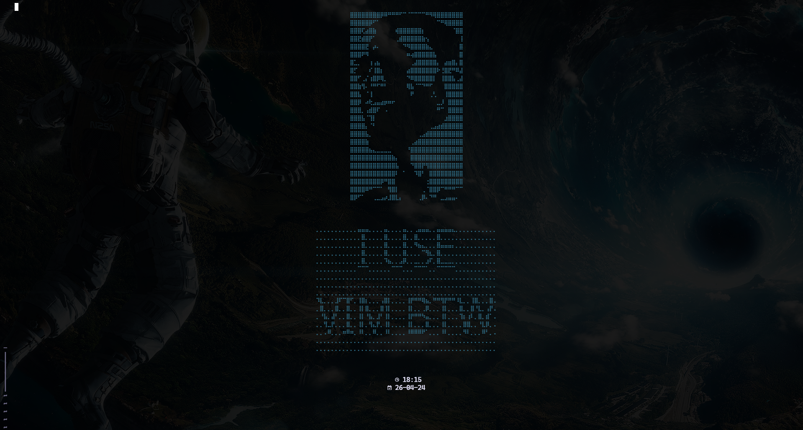

# Personal NeoVim Setup

<!--toc:start-->

- [Personal NeoVim Setup](#personal-neovim-setup)
  - [DISCLAIMER](#disclaimer)
  - [Dependencies](#dependencies)
  <!--toc:end-->

## DISCLAIMER

This setup is quite poorly welded together and is rather messy, _but it works_.

Critique it all you want, if it works for me it works for me y'know.

For plugins and other things I want to implement, see [TODO.md](/TODO.md).
Will also add issues to keep track of complications.

## Dependencies

Use a package manager of your choice to install these:

- ripgrep
- pandoc
